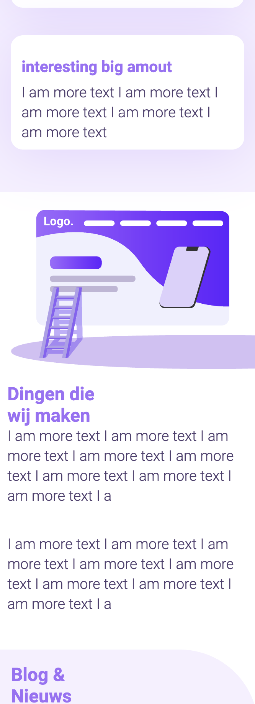
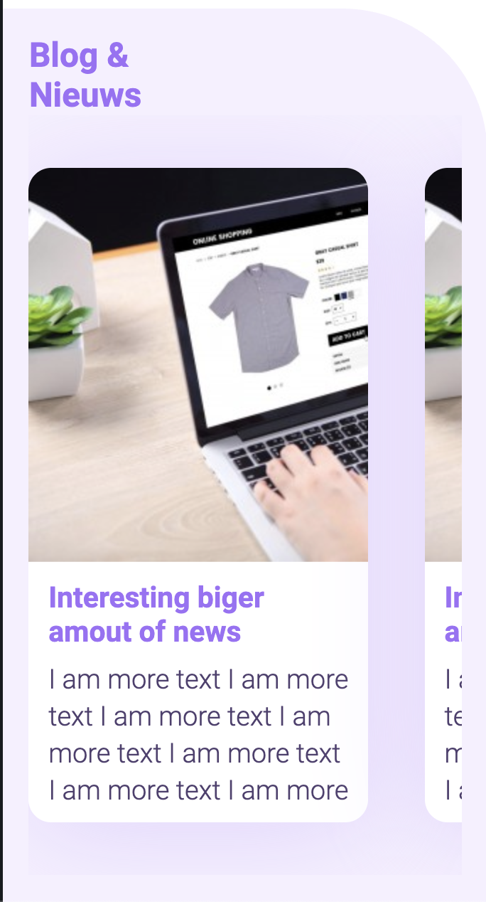
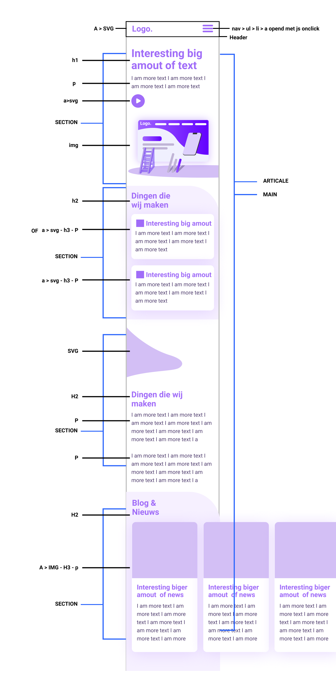

# Procesverslag
**Auteur:** -Wies de Munck-

## Bronnenlijst
1. Rachied/Sanne - Css carousel scrollbar : css regel 22

## Eindgesprek (week 7/8)

In deze week voorhet eind gesprek heb ik de pagina's die ik eerder had ontworpen.
Gevult met tekst en responsive gemaakt.

Ik had voral moeite met het hamburger menu.
Dit kwam deels door een sledhte planning.
Hierdoor heb ik mij zef moeten te weinign tijd

voorpagina

blog pagina

## Voortgang 3 (week 6)

In deze week heb ik geen vooruit gang geboekt.

## Voortgang 2 (week 5)

In deze week ben ik begonnen het het maken van pagina 2.
Ben tegen geen problemen aangelopen. 

## Voortgang 1 (week 3)

### Stand van zaken

Aan de eerste pagina begonnen er missen nog elementen, maar het skalet staat.

**Screenshot(s):**

### Agenda voor meeting

-samen met je groepje opstellen-

| Rachid      
| Had als feedback dat ik de scrollbar
| was vergeten te verstoppen van de carousel.
| 
| 

### Verslag van meeting

-na afloop snel uitkomsten vastleggen-

## Breakdownschets (week 1)

## Intake (week 1)
-uitwerken voor de kick-off werkgroep - begin van de eerste week-

**Je startniveau:** -zwart-

**Je focus:** -Responsive-

**Je opdracht:** - Hier is de link naar mijn eigen ontwerp https://www.figma.com/file/HIvo1ms32MjCC2dFWI0p6U/Untitled-Copy?node-id=0%3A1 -

**Screenshot(s) van de eerste pagina (small screen):**

**Screenshot(s) van de tweede pagina (small screen):**

